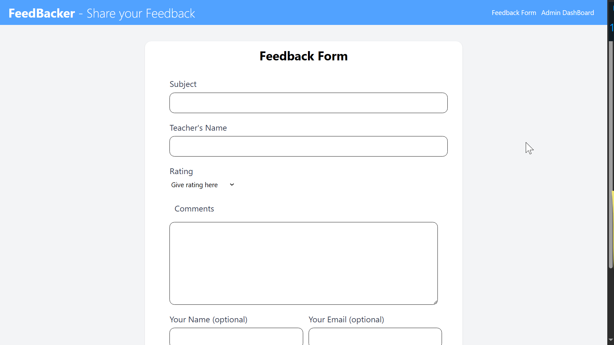
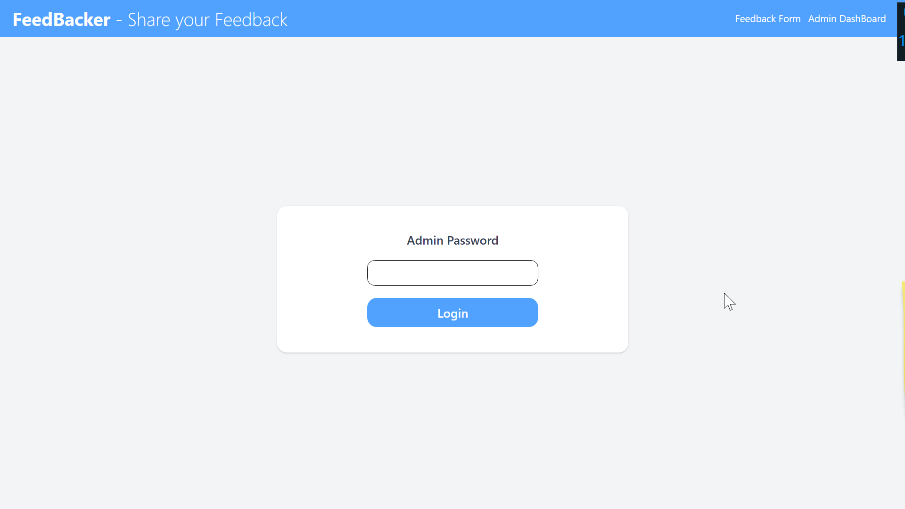
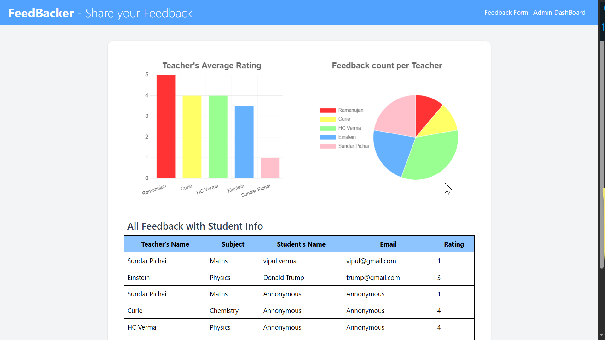

#  FeedBacker

**FeedBacker** is a full-stack MERN+ application that enables students to submit anonymous or open feedback for their teachers. Admins get access to a dedicated dashboard to review all feedback entries and visualize data through insightful bar and pie charts.

---

##  Features

-  Students can share feedback easily.
-  Admin dashboard to review all feedback entries.
-  Visual feedback analytics using bar and pie charts.
-  Fast UI built with Tailwind CSS and Vite.
-  RESTful API using Express and MongoDB.

---

##  Tech Stack

###  Frontend

- **React** 
- **React Router DOM** 
- **Tailwind CSS**
- **Vite** 
- **Axios** 
- **Chart.js** 
- **react-chartjs-2** 

###  Backend

- **Node.js**
- **Express** 
- **MongoDB** + **Mongoose** 
- **dotenv** 
- **cors** 
- **nodemon**

---
## 🖼 Screenshots

### Feedback Form

### Admin Login

### Admin Dashboard

